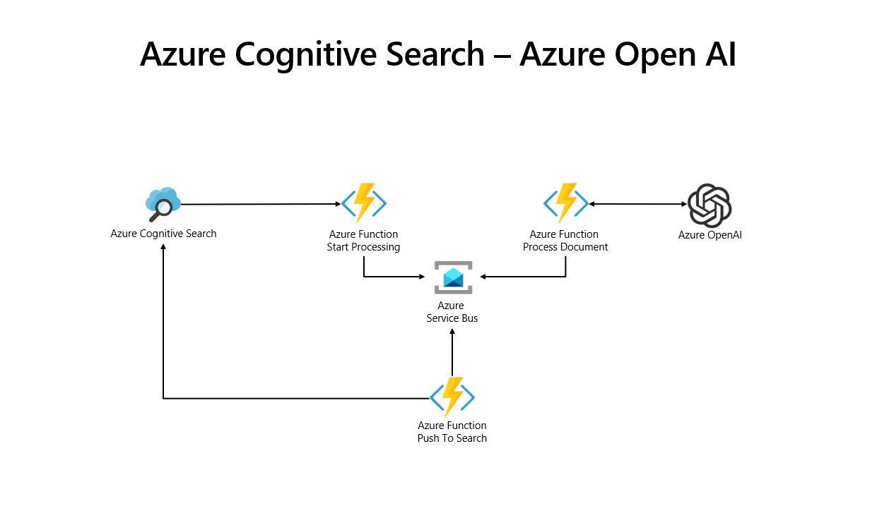

# Azure Cognitive Search Async Azure OpenAI

This repo implements a simple async pattern to process text extracted from an Azure Cognitive Search index with Azure OpenAI for entity enrichments. 
<br>
<br>
Through a custom prompt, you can extract different entities to enrich your search experience with more relevant facets or filters, enabling easier document discovery and retrieval. 
<br>
<br>
As a research company, you may be interested in extracting material properties out of papers, or in the Telco industry, you may want to extract information over your call center data in multiple digital channels or just summarize the customer conversations. In the Oil&Gas sector, you may need to analyze drilling report to extract business critical information.
<br>
<br>

Combining Azure Cognitive Search with Azure OpenAI is a simple and effective way to get personalized experiences without training complex Machine Learning models for entity extracting and search enrichment.

## Architecture



To decouple the Azure Cognitive Search indexing pipeline from Azure OpenAI document processing, we implemented 3 Azure Functions which are able to start the processing by queueing the data in a Service Bus, process the document by retrieving the data from the Service Bus, and calling Azure OpenAI push the data back to Azure Cognitive Search through the Push API.


Azure Functions:
-	Start processing - Called by Azure Cognitive Search via HTTP to start processing a document with Azure OpenAI
-	Process document - Service bus triggered function to process the text received from Azure Cognitive Search with Azure OpenAI
-	Push Search - Service bus triggered function to push the results back to Azure Cognitive Search 

## How to personalize your Azure OpenAI prompt
You can add your Azure OpenAI prompt to extract specific entities in the environmental settings of the Azure Function.
<br>
The defined keys have to be added in the OPENAI_PROMPTS_KEYS as well to enable the data Push to the Azure Cognitive Search index.
<br>
Please be sure to create the relevant fields in your index before start pushing the data in, otherwise the Azure Function will issue an error when trying to upload the data.


## Environment variables
| App Setting | Value | Note |
| --- | --- | ------------- |
| AzureWebJobsStorage | YOUR_AZURE_BLOB_STORAGE_CONNECTION_STRING | Azure Blob Storage connection string for Azure Function execution |
| AzureServiceBusConnectionString | YOUR_AZURE_SERVICE_BUS_CONNECTION_STRING | Azure Services Bus connection string for queue data for Azure Function execution | 
| FUNCTIONS_WORKER_RUNTIME | python | To not change |
| OPENAI_API_BASE | https://YOUR_AZURE_OPENAI_RESOURCE.openai.azure.com/ | Your Azure OpenAI Resource name. Get it in the [Azure Portal](https://portal.azure.com)|
| OPENAI_API_KEY| YOUR_AZURE_OPENAI_KEY | Your Azure OpenAI API Key. Get it in the [Azure Portal](https://portal.azure.com)|
| OPENAI_DEPLOYMENT_NAME|text-davinci-003|Instruction engines deployed in your Azure OpenAI resource|
| OPENAI_TEMPERATURE | 0.1 | OpenAI Temperature | 
| OPENAI_MAX_TOKENS | 800 | OpenAI Max Tokens |
| OPENAI_TOP_P | 0.9 | OpenAI Top P | ,
| OPENAI_FREQUENCY_PENALTY | 0.8 | OpenAI Frequency Penalty |
| OPENAI_PRESENCE_PENALTY | 0.0 | OpenAI Presence Penalty |
| OPENAI_PROMPT | Execute these tasks:<br>-  Summarize the conversation, key: summary<br>-  Is the customer satisfied with the interaction with the agent, key: customer_satisfied<br>Answer in JSON machine-readable format, using the keys from above.<br>Format the output as JSON object called 'results'.<br>Pretty print the JSON and make sure that is properly closed at the end.| Your OpenAI Prompt |
| OPENAI_PROMPT_KEYS | summary:Edm.String:False,customer_satisfied:Edm.String:True | Type currently supported 'Edm.String' 'Edm.Int32' 'Edm.Int64' 'Edm.Double' 'Edm.Boolean'.|
| AZURE_SEARCH_SERVICE_NAME | YOUR_AZURE_COGNITIVE_SEARCH_NAME | Name of your Azure Cognitive Search resource |
| AZURE_SEARCH_API_KEY | YOUR_AZURE_COGNITIVE_SEARCH_API_KEY | API Key for your Azure Cognitive Search resource |
| AZURE_SEARCH_INDEX_NAME | YOUR_INDEX_NAME | Name of your index in Azure Cognitive Search|
| AZURE_SEARCH_API_VERSION | 2020-06-30-Preview | Api version for Azure Cognitive Search |


## Integraztion with Azure Cognitive Search - Cognitive Pipeline
-   [Index Defintion](#sample-index-definition)
-   [Skillset Defition](#sample-skillset-definition)
-   [Sample input](#sample-input)
-   [Sample output](#sample-output)

## Sample Index Definition
Field names need to be updated accordingly to your Azure OpenAI prompt keys.
```json
  "fields": [
    {
      "name": "summary",
      "type": "Edm.String",
      "searchable": true,
      "filterable": false,
      "retrievable": true,
      "sortable": false,
      "facetable": false,
      "key": false,
      "indexAnalyzer": null,
      "searchAnalyzer": null,
      "analyzer": "standard.lucene",
      "normalizer": null,
      "synonymMaps": []
    },
    {
      "name": "customer_satisfied",
      "type": "Edm.String",
      "searchable": true,
      "filterable": true,
      "retrievable": true,
      "sortable": true,
      "facetable": true,
      "key": false,
      "indexAnalyzer": null,
      "searchAnalyzer": null,
      "analyzer": "standard.lucene",
      "normalizer": null,
      "synonymMaps": []
    },
    ...
  ]
```

## Sample Skillset Definition

In order to use this skill in a cognitive search pipeline, you need to add a skill definition to your skillset.


```json
{
    "@odata.type": "#Microsoft.Skills.Custom.WebApiSkill",
    "name": "formrecognizer", 
    "description": "OpenAI Enricher",
    "uri": "[AzureFunctionEndpointUrl]/api/StartProcessing?code=[AzureFunctionDefaultHostKey]",
    "httpMethod": "POST",
    "timeout": "PT1M",
    "context": "/document",
    "batchSize": 1,
    "inputs": [
        {
            "name": "metadata_storage_path",
            "source": "/document/metadata_storage_path"
        },
        {
            "name": "text",
            "source": "/document/merged_content"
        }
    ],
    "outputs": [
        {
            "name": "status",
            "targetName": "status"
        }
    ]
}
```

## Sample Input:

```json
{
    "values": [
        {
            "recordId": "record1",
            "data": { 
                "metadata_storage_path": "XXXX",
				"text": "Text to be processed by Azure OpenAI"		
            }
        }
    ]
}
```

## Sample Output:
```json
{
    "values": [
        {
            "recordId": "record1",
            "data": {
                "status": "Processing document."
            },
            "errors": null,
            "warnings": null
        }
    ]
}
```